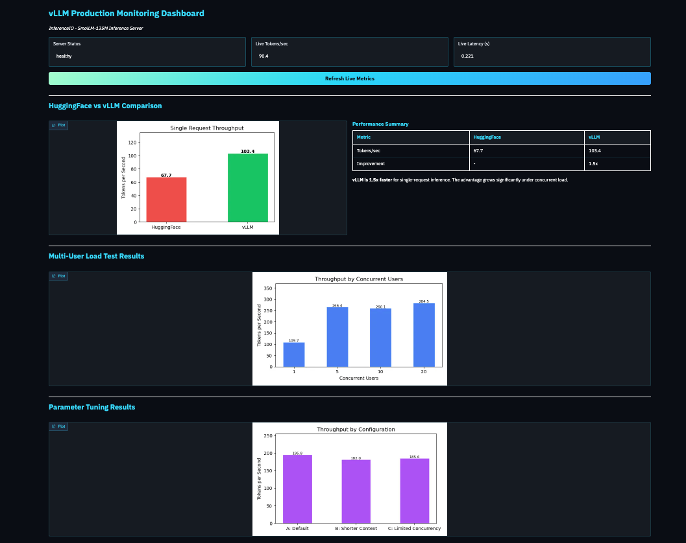

# vLLM : High-Throughput Serving Explained



A comprehensive project exploring the architecture, optimization, and production deployment of **vLLM**, the high-throughput inference engine for Large Language Models.

## Project Journey

This project is organized into progressive deep-dive modules, moving from traditional baseline inference to advanced memory management and production monitoring.

### The Modules

1. **1_huggingface.py** - **The Baseline**: Establish a performance benchmark using standard `transformers`.
2. **2_vllm_offline.py** - **Inference Acceleration**: First look at vLLM's optimized offline engine.
3. **3_kv_cache.py** - **The Bottleneck**: Visualize memory fragmentation in traditional serving systems.
4. **4_paged_attention.py** - **The Break-through**: Simulate vLLM's PagedAttention mechanism (inspired by OS paging).
5. **5_api_server.py** - **Production API**: Launch a production-ready, OpenAI-compatible server.
6. **6_concurrent_load.py** - **Scaling Under Load**: Stress test the server to see vLLM's scaling capabilities.
7. **7_tuning_vllm.py** - **Fine-Tuning Performance**: Optimize parameters for specific production workloads.
8. **8_dashboard.py** - **Capstone**: A live Gradio monitoring dashboard for real-time performance tracking.

## Repository Structure

```text
├── 1_huggingface.py        # Baseline benchmarks
├── 2_vllm_offline.py       # vLLM initial integration
├── 3_kv_cache.py           # Fragmentation modeling
├── 4_paged_attention.py    # PagedAttention simulator
├── 5_api_server.py         # Production API server
├── 6_concurrent_load.py    # Multi-user load testing
├── 7_tuning_vllm.py        # Optimization experiments
├── 8_dashboard.py          # Real-time monitoring UI
├── markers/                # Result tracking (automated)
├── README.md               # Project documentation
└── requirements.txt        # Full dependency list
```

## Performance Insights

- **PagedAttention**: Reclaims up to 80% of wasted KV cache memory by using non-contiguous allocation.
- **Continuous Batching**: Decouples request scheduling from batch size, maximizing throughput.
- **Scaling Behavior**: Demonstrates how throughput increases linearly with concurrent usage.

## Getting Started

### Prerequisites

- Python 3.10+
- Recommended: High-memory instance (runs on CPU for maximum compatibility).

### Setup

```bash
# Clone and install
git clone <your-repo-url>
cd vLLMs_intro
pip install -r requirements.txt

# Run the modules in sequence
python 1_huggingface.py
python 2_vllm_offline.py
# ...
```

---
